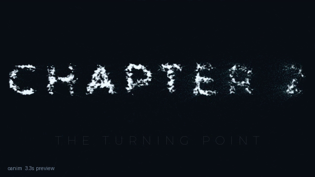
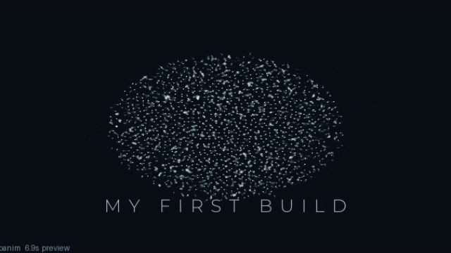

# TASKS — do one job, step by step

Pick your job. Follow the steps. Each step is one action.

---

## Start a new video from zero

1. Draw 3–5 boxes on paper. Each box: what shows + seconds. (Example:
   dust 1s → word 2s → rest 1s → burst 1s.)
2. `./oanim new myvideo` — open `my_videos/myvideo.py`.
3. Write your `Text(...)` line (words + subtitle).
4. Write your `FlowParticles(...)` line + the two `self.` lines.
5. Add ONE `play(...)` line. Preview. Add the next. Preview.
6. Set mood last (`theme=`, camera line).
7. `--mode draft` to judge. `n=4500` + `--mode final` to upload.

## Make an intro

1. `./oanim new intro`, write your channel words.
2. Keep `drift → form → hold` (3–6 seconds total).
3. Warm look: `theme="ember", motion_blur=0.6` + push-in camera.
4. Preview, draft, final. Done.

## Make a chapter card

1. Thin wide title: `Text("CHAPTER 2", subtitle="THE TURNING POINT", weight="Thin", tracking=20)`.
2. Slow wave in: `form(title, 1.6, sweep=1.2)`. Rest: `hold(1.2)`.
3. Punch out: `scatter(1.0, power=500.0)`.
4. Full file that runs: `task_chapter.py`. Render it, copy it, change words.



## Make an outro burst

1. After your last `hold`, add `scatter(1.4, power=340.0)`.
2. `150` = soft sigh, `600` = explosion. Pick one, preview.
3. Full example: `lesson3.py`.

## Add music or voice

1. Put your sound file next to your script (`vo.wav`).
2. `from engine.audio import AudioDrive`, then `drv = AudioDrive("vo.wav")`.
3. Add `drive=drv` to each `drift`/`form` line.
4. Preview. Motion and light now follow your sound.
5. Note: sound is NOT saved in the mp4. Add music in your editor.
6. No file yet? Practice with `SineDrive(bpm=132)` (`lesson7.py`).

## Make a vertical Short

1. Take any working video file. Change nothing in it.
2. `./oanim render my_videos/myvideo.py --mode short`.
3. Title auto-shrinks to fit. Check the thumbnail.

## Upload in 1080p

1. Change dust to `FlowParticles(n=4500, seed=...)` (same seed keeps look).
2. `./oanim render my_videos/myvideo.py --mode final`.
3. Wait ~30s per 5s of video. Upload the `.final.mp4`.

## Melt words into a flower

1. After a title `hold`, add `form(Bloom(scale=0.44, jitter=0.9), 2.2)`.
2. Add `Bloom` to the import line. Hold, then `scatter` to end.
3. Full file that runs: `build_demo.py`.



## Make a looping bed (video that never ends)

1. One long moment: `drift(60)`. No words.
2. Run with loop mode (not normal render):
```python
s = MyScene(out="bed.mp4", mode="draft"); s.construct(); s.render_loop(blend=0.6)
```
3. End flows back into start. Lay voice over it in your editor.

## FIX-IT — something wrong? Find it here

| You see | Why | Do this |
|---|---|---|
| `ModuleNotFoundError: engine` | File moved somewhere deep (scripts must live one folder below the project, like `my_videos/` or `course/`) | Put it back |
| Black video | Forgot the two `self.` lines | Add `self.particles = dots`, `self.text_obj = title` |
| Thin faint letters in final | Too few dots for 1080p | `n=4500` |
| Same dust every time | Same seed | Change `seed=` |
| Music changes nothing | Forgot the plug | Add `drive=drv` to the moment |
| No sound in mp4 | Normal — tool makes silent film | Add sound in your editor |
| Letters cut at the edge | Long word, small screen | Shorter word, or lower `tracking` |

## Three rules for fast learning

1. One change per preview. Two changes hide which one worked.
2. Copy before big cuts: `cp my_videos/a.py my_videos/a_try2.py`.
3. Keep the `.py`, delete test mp4s. The small file IS the video.
