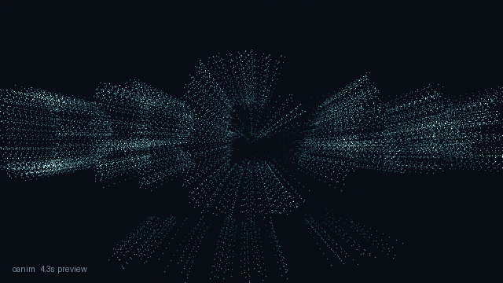
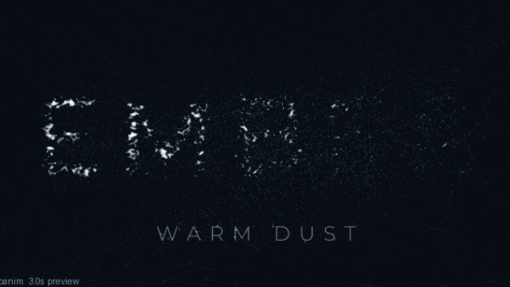
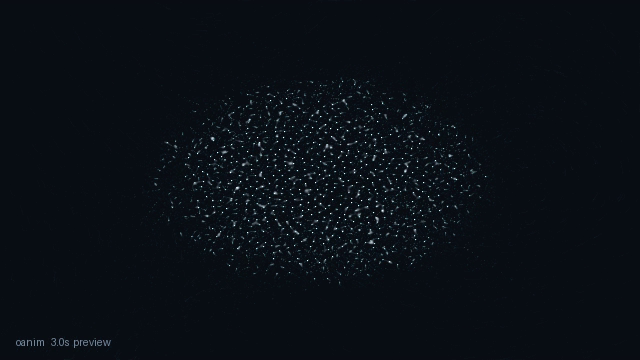
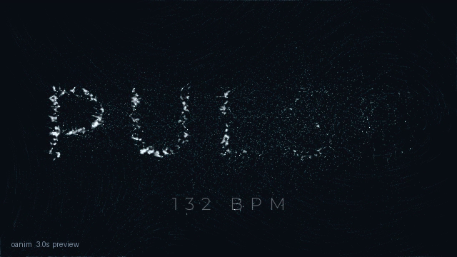

# LEARN — 7 small lessons (~40 minutes)

Do them in order. Each one: run a file, look, change one thing.
Files `lesson1.py` … `lesson7.py` are in this folder. They all run.
Every picture is a real frame from running them.

---

## Lesson 0 — three things (2 minutes, no running)

Open `lesson1.py`. Find these lines:

```python
title = Text("GROWTH", subtitle="ORGANIC MOTION",
             weight="Light", tracking=16)
dots = FlowParticles(n=1500, seed=7)
self.play(dots.drift(duration=1.6))
self.play(dots.form(title, duration=2.6, sweep=0.9))
self.play(self.hold(duration=1.0))
```

- `title` = your words.
- `dots` = your dust (1500 moving dots).
- `play(...)` lines = your time plan. Wander 1.6s, gather 2.6s, rest 1.0s.

Words + dust + time plan. That is all there is. Go to Lesson 1.

---

## Lesson 1 — run it (5 minutes)

Goal: see the tool work.

```sh
./oanim render course/lesson1.py --mode preview
```

Open `course/lesson1.preview.mp4`. The end looks like this:


Look for: grainy dust letters. Small subtitle line. A few dots still
floating. Alive, not frozen.

Run once more with `--mode draft` (same video, sharper). Rule from now on:
preview while you work, draft to judge, final once. Next lesson.

---

## Lesson 2 — your words (5 minutes)

Goal: your words on screen. Open `lesson2.py`. Only the words changed:

```python
        title = Text("DREAM", subtitle="EPISODE ONE",
                     weight="Light", tracking=18)
```

```sh
./oanim render course/lesson2.py --mode preview
```


Change `"DREAM"` to one of your words. Run again. Your word gathers from
dust. Full file below (copy it if you want your own copy):

```python
"""Lesson 2: your own words."""
import os
import sys
sys.path.insert(0, os.path.abspath(os.path.join(os.path.dirname(__file__), "..")))
from engine.api import Scene, Text, FlowParticles


class Lesson2(Scene):
    def construct(self):
        title = Text("DREAM", subtitle="EPISODE ONE",
                     weight="Light", tracking=18)
        dots = FlowParticles(n=1500, seed=7)
        self.particles = dots
        self.text_obj = title
        self.play(dots.drift(duration=1.6))
        self.play(dots.form(title, duration=2.6, sweep=0.9))
        self.play(self.hold(duration=1.0))


if __name__ == "__main__":
    out = os.path.abspath(os.path.join(os.path.dirname(__file__),
                                       "lesson2.preview.mp4"))
    Lesson2(out=out, mode="preview", thumbnail=False).construct_and_render()
```

Next lesson.

---

## Lesson 3 — words burst at the end (5 minutes)

Goal: add a moment. Open `lesson3.py`. New last line:

```python
        self.play(dots.scatter(duration=1.4, power=340.0))
```

`scatter` bursts words back into dust. Good for endings.

```sh
./oanim render course/lesson3.py --mode preview
```

Mid-burst looks like this:



Change `power=340.0` to `600.0`. Run. Wild burst. Change to `150.0`. Soft
sigh. That number is the burst strength. Next lesson.

---

## Lesson 4 — warm mood (5 minutes)

Goal: same words and dust, new feeling. Open `lesson4.py`. New pieces:

```python
from engine.api import Scene, Text, FlowParticles, Camera
        self.attach_camera(Camera().push_in(1.0, 1.06).handheld(1.2))
```

And the last lines say `theme="ember", motion_blur=0.6` (warm colors +
light trails).

```sh
./oanim render course/lesson4.py --mode preview
```



Warm orange. Streaky trails. Slow push-in. Delete the camera line and the
shot goes still. Try `theme="moss"` (green) or `"bone"` (grey). Next lesson.

---

## Lesson 5 — new look for free (5 minutes)

Goal: same title, new dust. Open `lesson5.py`. Two numbers changed:

```python
        dots = FlowParticles(n=1500, seed=21)
        self.play(dots.form(title, duration=2.6, sweep=0.4))
```

- `seed=21` (was 7): new random dust. Same words, new art.
- `sweep=0.4` (was 0.9): faster letter wave. `0` = all at once.

```sh
./oanim render course/lesson5.py --mode preview
```


Put it next to the Lesson 1 picture. Same word, different dust. Next lesson.

---

## Lesson 6 — a flower, no words (5 minutes)

Goal: dust can grow shapes. Open `lesson6.py`:

```python
from engine.api import Scene, FlowParticles, Bloom
        bloom = Bloom(scale=0.46, jitter=0.8)
        self.play(dots.form(bloom, duration=2.0, sweep=0.9))
```

```sh
./oanim render course/lesson6.py --mode preview
```



Change `Bloom(...)` to `Branch(depth=7, seed=11)` (fix the import too). A
tree grows. Then `DLA(sticks=900, seed=13)`. Lightning. Next lesson.

---

## Lesson 7 — dance to a beat (5 minutes)

Goal: motion follows sound. Open `lesson7.py`:

```python
from engine.audio import SineDrive
        beat = SineDrive(bpm=132)
        self.play(dots.drift(duration=1.0, drive=beat))
        self.play(dots.form(title, duration=1.6, sweep=0.9, drive=beat))
```

`drive=beat` plugs a pulse into any moment. Louder beat = stronger flow +
brighter dots. For your real sound file, use this instead:

```python
from engine.audio import AudioDrive
drv = AudioDrive("vo.wav")
```

```sh
./oanim render course/lesson7.py --mode preview
```



You know the whole tool now. Make your own: `TASKS.md` → "Start a new
video from zero".
