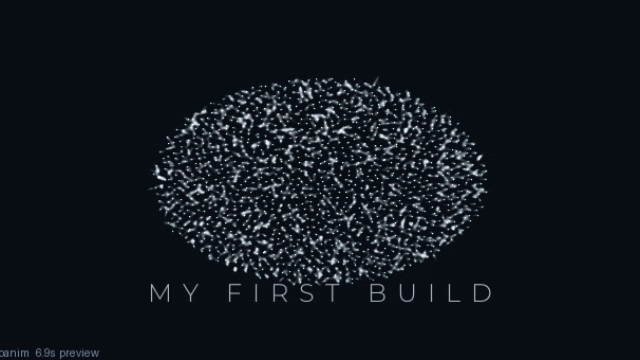

# BUILD: make your own video from zero

The lessons showed you pieces. Now you build a whole video that is yours:
your words, your order of moments, your mood. Do it in 6 small steps. After
each step, run a preview — you always see where you stand.

We will build this: dust wanders → your word appears → word melts into a
flower → flower bursts. The finished file is `build_demo.py` (in this
folder, runs as-is). Its ending looks like this:



## Step 0 — plan on paper first (2 minutes)

Draw 4 boxes. Write what shows in each + seconds:

| Box | Shows | Seconds |
|---|---|---|
| 1 | dust wanders | 1.2 |
| 2 | dust becomes OCEAN | 2.2 |
| 3 | OCEAN rests | 0.8 |
| 4 | OCEAN melts into a flower, rests, bursts | 2.2 + 0.6 + 1.2 |

Total: 8.2 seconds. Every video you ever make starts like this — boxes
first, code second. If you can't draw the boxes, you don't know what you
want yet.

## Step 1 — new file

```sh
./oanim new myown
```

Open `my_videos/myown.py`. Delete everything inside `construct` (keep the
outer lines). You now have an empty stage:

```python
class Myown(Scene):
    def construct(self):
        pass
```

## Step 2 — write your words (1 line)

Add one line inside `construct`:

```python
        title = Text("OCEAN", subtitle="MY FIRST BUILD",
                     weight="Light", tracking=18)
```

- `"OCEAN"` — big word. `"MY FIRST BUILD"` — small line under it.
- `tracking=18` — space between letters. 14 = tight, 22 = wide and calm.
- Leave `weight="Light"`. It fits this look best.

## Step 3 — add the dust (1 line)

```python
        dots = FlowParticles(n=1500, seed=11)
        self.particles = dots
        self.text_obj = title
```

- `n=1500` — how many dots. 1500 for practice, 4500 for final 1080p.
- `seed=11` — which random pattern. Any whole number. Don't like the
  texture? Change this number, nothing else.
- The two `self.` lines hand your words and dust to the video. Always
  write them. Forget them and you get a black screen.

## Step 4 — add moments one at a time (the fun part)

Add ONE line, preview, watch. Then the next. Never write five lines blind.

```python
        self.play(dots.drift(duration=1.2))
```

Preview now: dust wanders for 1.2s on black. Good? Add:

```python
        self.play(dots.form(title, duration=2.2, sweep=1.0))
```

Preview: dust gathers into OCEAN, left to right. (`sweep=1.0` = the wave
speed. `0` = all letters at once.)

```python
        self.play(self.hold(duration=0.8))
```

Preview: word rests. Now the trick — a SECOND `form`, into a flower.
Words can melt into shapes:

```python
        self.play(dots.form(Bloom(scale=0.44, jitter=0.9),
                            duration=2.2, sweep=0.8))
        self.play(self.hold(duration=0.6))
```

(Add `Bloom` to the top import line:
`from engine.api import Scene, Text, FlowParticles, Bloom`.)

Preview: OCEAN breaks apart and grows into a flower. Finish with a burst:

```python
        self.play(dots.scatter(duration=1.2, power=300.0))
```

Preview the whole thing. You just built boxes 1–4 from your paper.

## Step 5 — mood last (2 lines, optional)

Mood goes at the END of the file, in the `if __name__` block — find the
`Lesson`/`Myown(out=out, mode=...)` line and add settings:

```python
    Myown(out=out, mode="preview", theme="ember",
          motion_blur=0.6, thumbnail=False).construct_and_render()
```

- `theme="ember"` — warm fire colors. Others: `ink` (default moonlight),
  `bone` (grey), `moss` (green).
- `motion_blur=0.6` — light trails behind fast dots. `0` = off.

Camera shake/zoom lives in `construct` (one line, delete it for a still
shot):

```python
        self.attach_camera(Camera().push_in(1.0, 1.06).handheld(1.2))
```

(Add `Camera` to the imports.) Preview. Keep or delete — your call.

## Step 6 — draft, then final

```sh
./oanim render my_videos/myown.py --mode draft     # judge the real look
# change n=1500 to n=4500 in the dust line for 1080p, then:
./oanim render my_videos/myown.py --mode final     # upload this one
```

Done. That file IS your video. Copy it for the next one
(`cp my_videos/myown.py my_videos/ep02.py`) and change the words.

## 3 ready patterns (copy the moment lists)

**Words → flower → burst** (what you just built):
```python
drift(1.2) → form(title, 2.2) → hold(0.8) → form(Bloom(), 2.2) → hold(0.6) → scatter(1.2)
```

**Flower → tree (pure growth, no words):**
```python
drift(0.8) → form(Bloom(scale=0.44, jitter=0.9), 2.6) → form(Branch(depth=7, seed=5), 2.8) → hold(0.8)
```

**Title card with punch-out (chapter marker):**
```python
drift(0.6) → form(Text("CHAPTER 2", tracking=20), 1.6, sweep=1.2) → hold(1.2) → scatter(1.0, power=500.0)
```

## Playground rules (how to learn fast without breaking things)

1. **Change ONE thing per preview.** Two changes and you won't know which
   one worked.
2. **Copy before big surgery.** `cp my_videos/myown.py my_videos/myown_try2.py`.
   Copies are free, regret is not.
3. **Write down good seeds.** A `seed` you love is worth keeping — note it
   in a comment: `seed=11  # kept: nice grain`.
4. **Stuck? Shrink the problem.** New shape misbehaves? Test it alone:
   `drift(0.5) → form(NewThing, 2.0) → hold(0.5)`. Five lines tell the truth.
5. **End of day: keep the .py, delete the test mp4s.** The small file IS the
   video — you can re-render it any time in any size.
