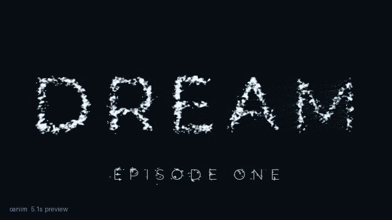
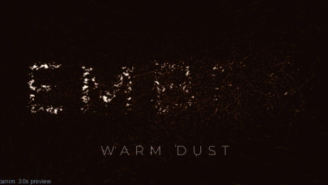
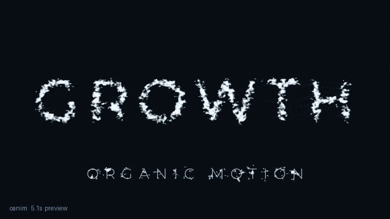

# Learn oanim by doing (7 small lessons, ~40 minutes)

This is a course, not a manual. Each lesson: **run one file, look at what
comes out, change one thing.** The files `lesson1.py` … `lesson7.py` are
already in this folder — every one of them runs, and every picture below is
a real frame from running them. Nothing here is made up.

How to use this page: do the lessons **in order**, don't skip ahead. Each
one takes about 5 minutes.

---

## Lesson 0 — the 3 words you need (2 minutes, no running)

Open `lesson1.py` and find these lines. Everything else is scaffolding you
can ignore for now:

```python
title = Text("GROWTH", subtitle="ORGANIC MOTION",   # your WORDS
             weight="Light", tracking=16)
dots = FlowParticles(n=1500, seed=7)                # your DUST (1500 dots)
self.play(dots.drift(duration=1.6))                 # your TIMELINE (moments)
self.play(dots.form(title, duration=2.6, sweep=0.9))
self.play(self.hold(duration=1.0))
```

That's the whole tool: **words + dust + moments.** A video is moments played
in order — here: wander 1.6s, gather into words 2.6s, rest 1.0s (5.2s total).

> Checkpoint: can you point at which line is the words, which is the dust,
> and which three lines are the timeline? If yes, go to Lesson 1.

---

## Lesson 1 — your first render (5 minutes)

**Goal:** see the tool work, learn the render habit.

**Run this** (from the project folder):

```sh
./oanim render my_videos/lesson1.py --mode preview
```

It takes a few seconds and writes `my_videos/lesson1.preview.mp4`. Open it.
It should look like this at the end:


**Notice 3 things:**
1. The letters are made of grainy dust, not flat color — that's the look.
2. Under the title, a smaller subtitle line reads ORGANIC MOTION.
3. A few stray dots still float around — the picture feels alive, not frozen.

**Try this:** run it again with `--mode draft` instead of `preview`. Same
video, sharper. Golden rule from now on: **preview while writing, draft to
judge, final once.**

> Checkpoint: you have an mp4 next to your script and you know which mode
> to use when. Done? Next lesson.

---

## Lesson 2 — your own words (5 minutes)

**Goal:** put your words on screen. This is the file:

```python
"""Lesson 2: your own words."""
import os
import sys
sys.path.insert(0, os.path.abspath(os.path.join(os.path.dirname(__file__), "..")))
from engine.api import Scene, Text, FlowParticles


class Lesson2(Scene):
    def construct(self):
        title = Text("DREAM", subtitle="EPISODE ONE",
                     weight="Light", tracking=18)
        dots = FlowParticles(n=1500, seed=7)
        self.particles = dots
        self.text_obj = title
        self.play(dots.drift(duration=1.6))
        self.play(dots.form(title, duration=2.6, sweep=0.9))
        self.play(self.hold(duration=1.0))


if __name__ == "__main__":
    out = os.path.abspath(os.path.join(os.path.dirname(__file__),
                                       "lesson2.preview.mp4"))
    Lesson2(out=out, mode="preview", thumbnail=False).construct_and_render()
```

Only two things changed from Lesson 1: the words (`"DREAM"` /
`"EPISODE ONE"`) and `tracking=18` (slightly wider letter spacing).

**Run:** `./oanim render my_videos/lesson2.py --mode preview`



**Try this:** open `lesson2.py`, change `"DREAM"` to a word of YOUR channel
(any short word), re-render in preview. Watch your word gather from dust.
That feeling is the whole point of the tool.

> Checkpoint: your word, on screen, formed from dust. Next.

---

## Lesson 3 — timeline + a burst ending (5 minutes)

**Goal:** learn that the timeline is just a list — reorder it, extend it.

New moment: `scatter` — the words burst apart into dust. Made for endings:

```python
        self.play(dots.drift(duration=1.0))
        self.play(dots.form(title, duration=2.0, sweep=0.9))
        self.play(self.hold(duration=0.6))
        self.play(dots.scatter(duration=1.4, power=340.0))
```

(Full file is `lesson3.py` — same wrapper as Lesson 2, only the four
`play` lines and the words differ.)

**Run:** `./oanim render my_videos/lesson3.py --mode preview`

Mid-burst it looks like this — letters flying outward, dissolving:


**Try this:** change `power=340.0` to `power=600.0` and re-render. The burst
gets violent. Change it to `150.0` — a gentle sigh instead. `power` is how
hard the words explode. (Full file: `lesson3.py`.)

> Checkpoint: you can read a timeline and predict what the video does.
> Next.

---

## Lesson 4 — mood: color, trails, camera (5 minutes)

**Goal:** same words-dust-moments, completely different feeling.

```python
from engine.api import Scene, Text, FlowParticles, Camera


class Lesson4(Scene):
    def construct(self):
        title = Text("EMBER", subtitle="WARM DUST",
                     weight="Light", tracking=18)
        dots = FlowParticles(n=900, seed=3)
        self.particles = dots
        self.text_obj = title
        self.attach_camera(Camera().push_in(1.0, 1.06).handheld(1.2))
        self.play(dots.drift(duration=1.0))
        self.play(dots.form(title, duration=1.6, sweep=0.9))
        self.play(self.hold(duration=0.5))
```

(Full file: `lesson4.py`. The warm look itself comes from the last lines
of that file — `theme="ember", motion_blur=0.6` are scene settings, set once
for the whole video, not inside the moments.)

**Run:** `./oanim render my_videos/lesson4.py --mode preview`



**Notice 3 things:**
1. Everything is warm orange — that's `theme="ember"` (default is `ink`, moonlight blue).
2. Dots leave streaky trails — that's `motion_blur=0.6`.
3. The frame slowly pushes in with a tiny shake — that's the `Camera` line. Delete that line and the shot goes still.

**Try this:** change `"EMBER"` to your Lesson-2 word but keep the ember
theme. Same word, new mood. Other themes to try later: `bone`, `moss`.

> Checkpoint: you know where mood lives (theme, blur, camera). Next.

---

## Lesson 5 — free variations: seed and sweep (5 minutes)

**Goal:** same title, new texture, for free.

Open `lesson5.py` and find these two lines. Change just the numbers:

```python
        dots = FlowParticles(n=1500, seed=21)
```
`seed=` picks a different random dust pattern. Same words, new texture.
Out of ideas? Change the seed. (Lesson 1 used `seed=7` — compare the two
pictures and you'll see different dust.)

```python
        self.play(dots.form(title, duration=2.6, sweep=0.4))
```
`sweep=` controls the reveal wave: `0` = all letters at once, `0.4` =
fast wave, `0.9` = slow wave, `1.2` = very slow wave. (Lesson 1 used `0.9`.)

**Run:** `./oanim render my_videos/lesson5.py --mode preview`



Compare with the Lesson 1 picture: same word, different dust. Two renders,
two artworks, zero extra work.

**Try this:** set `sweep=0` and re-render. All letters slam in together —
usually worse, now you know what the knob does.

> Checkpoint: seed = new artwork, sweep = reveal wave. Next.

---

## Lesson 6 — no words, just growth (5 minutes)

**Goal:** the dust can become shapes, not just letters.

```python
from engine.api import Scene, FlowParticles, Bloom


class Lesson6(Scene):
    def construct(self):
        bloom = Bloom(scale=0.46, jitter=0.8)
        dots = FlowParticles(n=1100, seed=9)
        self.particles = dots
        self.text_obj = bloom
        self.play(dots.drift(duration=0.6))
        self.play(dots.form(bloom, duration=2.0, sweep=0.9))
        self.play(self.hold(duration=0.5))
```

`form()` accepts anything formable — `Bloom()` (flower), `Branch(depth=7)`
(tree), `DLA(sticks=900)` (lightning). Same moments, no words.

**Run:** `./oanim render my_videos/lesson6.py --mode preview`


**Try this:** replace `Bloom(scale=0.46, jitter=0.8)` with
`Branch(depth=7, seed=11)` (add `Branch` to the import) and re-render. A
tree grows. Then try `DLA(sticks=900, seed=13)`. Three living shapes, one
line each.

> Checkpoint: `form()` takes words OR shapes. Next — the last lesson.

---

## Lesson 7 — motion follows a beat (5 minutes)

**Goal:** make the dust dance to sound.

```python
from engine.api import Scene, Text, FlowParticles
from engine.audio import SineDrive


class Lesson7(Scene):
    def construct(self):
        beat = SineDrive(bpm=132)
        title = Text("PULSE", subtitle="132 BPM",
                     weight="Light", tracking=18)
        dots = FlowParticles(n=900, seed=21)
        self.particles = dots
        self.text_obj = title
        self.play(dots.drift(duration=1.0, drive=beat))
        self.play(dots.form(title, duration=1.6, sweep=0.9, drive=beat))
        self.play(self.hold(duration=0.5))
```

`drive=beat` plugs a pulse into any moment — flow gets stronger and stamps
get brighter on each beat. `SineDrive` is a built-in fake pulse for practice;
for your real videos use your own file:

```python
from engine.audio import AudioDrive
drv = AudioDrive("vo.wav")   # your voiceover or music
```

**Run:** `./oanim render my_videos/lesson7.py --mode preview`


> Checkpoint: you know what `drive=` does and the two drive flavors. You
> now know the whole tool. Graduate below.

---

## Graduation — your first real upload

1. `./oanim new myfirst` — fresh file, no lesson baggage.
2. Write your words, pick a theme. Preview until the motion feels right.
3. Draft to judge the texture. Tweak `seed` / `sweep` / durations.
4. Set `FlowParticles(n=4500)` and render `--mode final` — 1080p, ~30s wait for 5s of video.
5. Upload `my_videos/myfirst.final.mp4`. Done. That's someone's intro now.

Vertical Short? Same file, `--mode short`. Voiceover sync? `AudioDrive`.

## When something looks wrong

| You see | It means | Fix |
|---|---|---|
| `ModuleNotFoundError: engine` | Script can't find the tool | File must live in `my_videos/` (one folder below the project) — don't move lesson files elsewhere |
| Letters thin/faint in final | Too few dots for 1080p | `n=4500` |
| Same dust every time | Same seed | Change `seed=` |
| Motion ignores music | Forgot the plug | Pass `drive=drv` to the moment |
| Can't hear audio in the mp4 | Normal — drive shapes motion, the tool never mixes sound | Add music in your editor (CapCut/Premiere) |
| `ffmpeg` errors with AudioDrive | Bad audio path | Check the wav path; test without `drive` first |

Stuck after that? Open the closest `scenes/` example, read it, copy the
idea into your file. Never edit files outside `my_videos/`.
