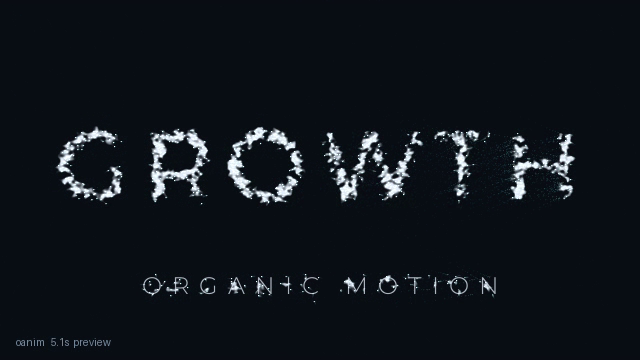

# START — make your first video in 5 minutes

**What do you want? Pick one:**

- **First video now** → stay here, 3 steps below.
- **Learn step by step** → `LEARN.md` (7 small lessons).
- **Do one job** (intro, music, Shorts…) → `TASKS.md`.
- **Look up a setting** → `REFERENCE.md` (all functions, one page).
- **Know why things work this way** → `IDEAS.md` (short).

---

## Your first video (3 steps, 5 minutes)

**Step 1.** Run this (from the project folder):

```sh
./oanim render my_videos/lesson1.py --mode preview
```

Wait a few seconds. You will see `WROTE my_videos/lesson1.preview.mp4`.

**Step 2.** Open `my_videos/lesson1.preview.mp4` and watch it.

**Step 3.** Check: dust wanders, then becomes the word GROWTH.



It looks like this at the end. Grainy letters made of dust. That is the tool.

**Next:** open `LEARN.md` Lesson 1. It starts from this same video and
teaches you to change it.
